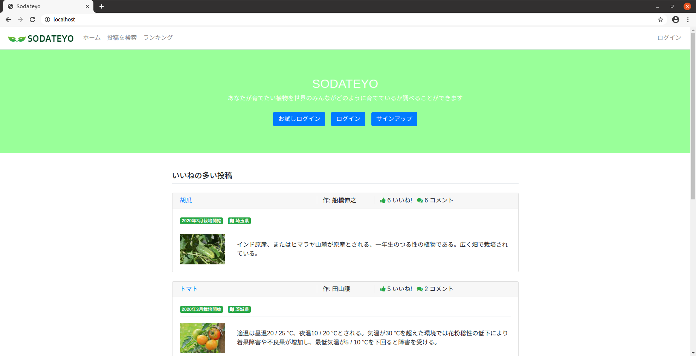

# SODATEYO
植物の成長を皆で報告・共有できるアプリです。 
カレンダーで月ごとの植物の成長を投稿出来ます。

## 制作背景
最近、趣味として家庭菜園を初めました。
しかし初めての家庭菜園では、月ごとにどの程度成長しているか不安になります。
「後どれだけで芽が出るんだろう？」 
「花が咲くのはいつだろう？」 
「いつ収穫出来るんだろう」
という悩みを解決したくこのアプリを制作しました。

## URL
 https://????????????
- 非ログイン状態の場合は閲覧、検索のみ可能です。ログインすると投稿やコメントが可能になります。 
- ログイン画面の「かんたんログイン」をクリックすると、メールアドレスとパスワードを入力せずにログインできます。 
- メールアドレス"`admin@example.com`"、パスワード"`12345678`"で【管理者】としてログインできます。 
- 【管理者】は、他の一般ユーザーのアカウントや投稿、コメントを削除できる権限を持ちます。 

## 使用技術
- Ruby 2.7.1, Rails 5.2.4.3
- MySQL 5.7.22
- Nginx, Puma
- AWS（VPC, ECS, ECR, RDS, Route 53, ALB, ACM, S3, CloudFront）
- Docker/docker-compose
- CircleCI (CI/CDパイプラインを構築)
- RSpec
- Bootstrap, jQuery

## AWS構成図

## 機能一覧
- ユーザー機能
  - 新規登録、ログイン、ログアウト機能
  - マイページ、登録情報編集機能
- 記事関係
  - 記事一覧表示、記事詳細表示、記事投稿、記事編集
  - 複数の検索条件で検索可能
  - 画像のアップロードはcarrierwaveを使用
  - 画像はs3にアップロード
  - ページネーションはkaminariを使用
- カレンダー関係
  - カレンダーの表示、カレンダー投稿、カレンダー編集
  - 画像のアップロードはcarrierwaveを使用
  - カレンダー登録、編集フォームにmodalを使用
- いいね機能
  - 記事ごとにいいね！が可能
  - 記事ごとにいいね！の数を表示
  - Ajaxを使用
- コメント関係
  - コメント表示、コメント投稿
  - Ajaxを使用
- フォロー機能
  - フォロー、フォロワー一覧表示機能
  - Ajaxを使用
- Rspecによる自動テスト機能
  - 単体テスト機能
  - 統合テスト機能
